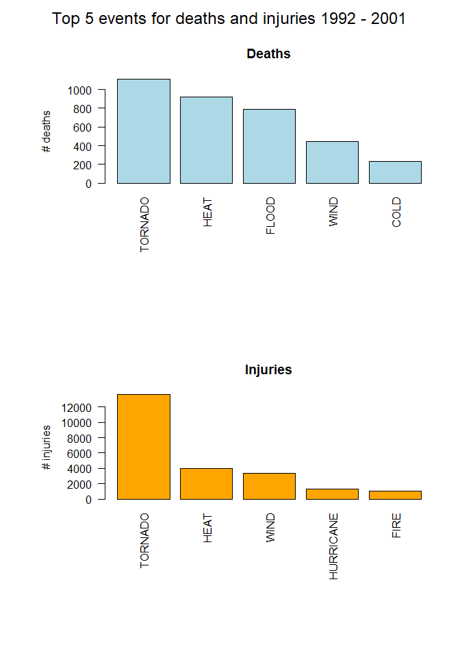

##Synopsis
TBC - Describe analysis briefly in 10 sentences


##Data processing
The sections below describe how the data were loaded and processed for analysis

###Packages used

```r
library(dplyr)
```

```
## 
## Attaching package: 'dplyr'
```

```
## The following objects are masked from 'package:stats':
## 
##     filter, lag
```

```
## The following objects are masked from 'package:base':
## 
##     intersect, setdiff, setequal, union
```

```r
library(lattice)
library(tidyr)
```

###Load data

A link to the storm data is found on the Coursera website:
https://www.coursera.org/learn/reproducible-research/peer/OMZ37/course-project-2

Right click the Storm Data hyperlink and copy link address:
https://d396qusza40orc.cloudfront.net/repdata%2Fdata%2FStormData.csv.bz2

Assign the link address to variable url, and use to download file to working directory.

Use the chunk option cache = TRUE to save knit time.


```r
url <- "https://d396qusza40orc.cloudfront.net/repdata%2Fdata%2FStormData.csv.bz2"
filename <- "storm-data.csv.bz2"  # Saved file name, saved to working directory
download.file(url, filename)
data <- read.csv(filename)
```


###Process data for analysis
Process an analysis dataset for health question
Relevant variables are STATE, EVTYPE, FATALITIES, INJURIES

Process an analysis dataset for economy question
Relevant variables are BGN_DATE, BGN_TIME, STATE, EVTYPE, PROPDMG:CROPDMGEXP, REMARKS, REFNUM


```r
health <- data %>% select(STATE, EVTYPE, FATALITIES, INJURIES)
tidyhealth <- gather(health, outcome, count, -STATE, -EVTYPE)
tidyhealth$outcome <- as.factor(tidyhealth$outcome)

# create subsets for last 10 years, and 10 years before that
# convert data column to date

data$BGN_DATE <- as.Date(as.POSIXct(data$BGN_DATE, format = "%m/%d/%Y %H:%M:%S"))

date1 <- as.Date("2001-12-31")
date2 <- as.Date("2012-01-01")
date3 <- as.Date("1991-12-31")
date4 <- as.Date("2002-01-01")

data90s <- data[data$BGN_DATE > date1 & data$BGN_DATE < date2, ]
h90s <- data90s %>% select(STATE, EVTYPE, FATALITIES, INJURIES)
tidyh90s <- gather(h90s, outcome, count, -STATE, -EVTYPE)
tidyh90s$outcome <- as.factor(tidyh90s$outcome)

data00s <- data[data$BGN_DATE > date3 & data$BGN_DATE < date4, ]
h00s <- data00s %>% select(STATE, EVTYPE, FATALITIES, INJURIES)
tidy00s <- gather(h00s, outcome, count, -STATE, -EVTYPE)
tidy00s$outcome <- as.factor(tidy00s$outcome)


econ <- data %>% select(BGN_DATE, BGN_TIME, STATE, EVTYPE, PROPDMG:CROPDMGEXP, REMARKS, REFNUM)

head(tidyhealth, 3)
```

```
##   STATE  EVTYPE    outcome count
## 1    AL TORNADO FATALITIES     0
## 2    AL TORNADO FATALITIES     0
## 3    AL TORNADO FATALITIES     0
```

###Determine which weather event caused most injuries and fatalities across entire US
Use tapply to determine the number of injuries and fatalities for each weather event.
The number of unique weather events is large, with 985 different types of weather event.
A meaningful barchart is difficult to format with this many events therefore equations have 
been used to determine the weather event responsible for the most injuries and fatalities.


```r
harm_event <- with(tidyhealth,
                   tapply(count, 
                          list(EVTYPE, outcome), 
                          sum,
                          na.rm = TRUE)) %>% 
        as.data.frame()

harm_event90s <- with(tidyh90s,
                      tapply(count, 
                             list(EVTYPE, outcome), 
                             sum,
                             na.rm = TRUE)) %>% 
        as.data.frame()

harm_event00s <- with(tidy00s,
                      tapply(count, 
                             list(EVTYPE, outcome), 
                             sum,
                             na.rm = TRUE)) %>% 
        as.data.frame()

fatal <- harm_event[which.max(harm_event$FATALITIES), ] # harm_event must be df for this to work
fatalevent <- rownames(fatal)
nfatal <- fatal[1,1]

fatal90s <- harm_event90s[which.max(harm_event90s$FATALITIES), ] # harm_event must be df for this to work
fatalevent90s <- rownames(fatal90s)
nfatal90s <- fatal90s[1,1]

fatal00s <- harm_event00s[which.max(harm_event00s$FATALITIES), ] # harm_event must be df for this to work
fatalevent00s <- rownames(fatal00s)
nfatal00s <- fatal00s[1,1]

injury <- harm_event[which.max(harm_event$INJURIES), ]
injuryevent <- rownames(injury)
ninjury <- injury[1,2]

injury90s <- harm_event90s[which.max(harm_event90s$INJURIES), ]
injuryevent90s <- rownames(injury90s)
ninjury90s <- injury90s[1,2]

injury00s <- harm_event00s[which.max(harm_event00s$INJURIES), ]
injuryevent00s <- rownames(injury00s)
ninjury00s <- injury00s[1,2]
```

Rank the data so that a sensible number of events can be plotted


```r
fatal_rank <- harm_event[order(harm_event$FATALITIES, decreasing = TRUE), ]
fatal_top_10 <- fatal_rank[1:10, ]

fatal90s_rank <- harm_event90s[order(harm_event90s$FATALITIES, decreasing = TRUE), ]
fatal90s_top_10 <- fatal90s_rank[1:10, ]

fatal00s_rank <- harm_event00s[order(harm_event00s$FATALITIES, decreasing = TRUE), ]
fatal00s_top_10 <- fatal00s_rank[1:10, ]

injury_rank <- harm_event[order(harm_event$INJURIES, decreasing = TRUE), ]
injury_top_10 <- injury_rank[1:10, ]

injury90s_rank <- harm_event90s[order(harm_event90s$INJURIES, decreasing = TRUE), ]
injury90s_top_10 <- injury90s_rank[1:10, ]

injury00s_rank <- harm_event00s[order(harm_event00s$INJURIES, decreasing = TRUE), ]
injury00s_top_10 <- injury00s_rank[1:10, ]

str(fatal_top_10)
```

```
## 'data.frame':	10 obs. of  2 variables:
##  $ FATALITIES: num  5633 1903 978 937 816 ...
##  $ INJURIES  : num  91346 6525 1777 2100 5230 ...
```

```r
str(injury_top_10)
```

```
## 'data.frame':	10 obs. of  2 variables:
##  $ FATALITIES: num  5633 504 470 1903 816 ...
##  $ INJURIES  : num  91346 6957 6789 6525 5230 ...
```

```r
fatal_top_10
```

```
##                FATALITIES INJURIES
## TORNADO              5633    91346
## EXCESSIVE HEAT       1903     6525
## FLASH FLOOD           978     1777
## HEAT                  937     2100
## LIGHTNING             816     5230
## TSTM WIND             504     6957
## FLOOD                 470     6789
## RIP CURRENT           368      232
## HIGH WIND             248     1137
## AVALANCHE             224      170
```

```r
injury_top_10
```

```
##                   FATALITIES INJURIES
## TORNADO                 5633    91346
## TSTM WIND                504     6957
## FLOOD                    470     6789
## EXCESSIVE HEAT          1903     6525
## LIGHTNING                816     5230
## HEAT                     937     2100
## ICE STORM                 89     1975
## FLASH FLOOD              978     1777
## THUNDERSTORM WIND        133     1488
## HAIL                      15     1361
```

```r
fatal00s_top_10
```

```
##                FATALITIES INJURIES
## EXCESSIVE HEAT       1212     3728
## HEAT                  708      878
## TORNADO               548    11045
## LIGHTNING             446     2980
## FLASH FLOOD           439     1260
## FLOOD                 223     6488
## TSTM WIND             178     2808
## HEAT WAVE             172      309
## RIP CURRENTS          160      215
## HIGH WIND             151      651
```

```r
injury00s_top_10
```

```
##                    FATALITIES INJURIES
## TORNADO                   548    11045
## FLOOD                     223     6488
## EXCESSIVE HEAT           1212     3728
## LIGHTNING                 446     2980
## TSTM WIND                 178     2808
## ICE STORM                  66     1873
## FLASH FLOOD               439     1260
## WINTER STORM              137     1077
## THUNDERSTORM WINDS         64      908
## HEAT                      708      878
```

```r
fatal90s_top_10
```

```
##                         FATALITIES INJURIES
## TORNADO                       1112    13588
## EXCESSIVE HEAT                 691     2797
## FLASH FLOOD                    539      517
## LIGHTNING                      370     2250
## RIP CURRENT                    340      208
## FLOOD                          247      301
## HEAT                           229     1222
## AVALANCHE                      145      103
## THUNDERSTORM WIND              130     1400
## EXTREME COLD/WIND CHILL        125       24
```

```r
injury90s_top_10
```

```
##                   FATALITIES INJURIES
## TORNADO                 1112    13588
## EXCESSIVE HEAT           691     2797
## LIGHTNING                370     2250
## THUNDERSTORM WIND        130     1400
## HURRICANE/TYPHOON         64     1275
## HEAT                     229     1222
## TSTM WIND                 77     1146
## WILDFIRE                  75      911
## FLASH FLOOD              539      517
## HIGH WIND                 97      486
```


##Results
####Across the United States, which types of events (as indicated in the \color{red}{\verb|EVTYPE|}EVTYPE variable) are most harmful with respect to population health?

TORNADO was the weather event responsible for the most injuries and fatalities across the United States:


```r
fatal
```

```
##         FATALITIES INJURIES
## TORNADO       5633    91346
```

```r
injury
```

```
##         FATALITIES INJURIES
## TORNADO       5633    91346
```

```r
fatal00s
```

```
##                FATALITIES INJURIES
## EXCESSIVE HEAT       1212     3728
```

```r
injury00s
```

```
##         FATALITIES INJURIES
## TORNADO        548    11045
```

```r
fatal90s
```

```
##         FATALITIES INJURIES
## TORNADO       1112    13588
```

```r
injury90s
```

```
##         FATALITIES INJURIES
## TORNADO       1112    13588
```

TORNADO was responsible for 5633 fatalities and 91346 injuries in the period studied.


```r
par(mfrow=c(2, 1), 
    oma = c(0, 0, 2, 0),
    mar = c(12, 8, 4, 2),
    mgp = c(4, 1, 0))


barplot(fatal_top_10$FATALITIES, 
                     names.arg = rownames(fatal_top_10), 
                     las = 2,
                     col = "light blue",
                     main = "Deaths",
                     ylab = "# deaths")

barplot(injury_top_10$INJURIES, 
                     names.arg = rownames(injury_top_10), 
                     las = 2,
                     col = "orange",
                     main = "Injuries",
                     ylab = "# injuries")

mtext("Top 10 events for deaths and injuries over period studied", 
      outer = TRUE, 
      cex = 1.5)
```

<!-- -->


```r
par(mfrow=c(2, 1), 
    oma = c(0, 0, 2, 0),
    mar = c(12, 8, 4, 2),
    mgp = c(4, 1, 0))


barplot(fatal00s_top_10$FATALITIES, 
                     names.arg = rownames(fatal00s_top_10), 
                     las = 2,
                     col = "light blue",
                     main = "Deaths",
                     ylab = "# deaths")

barplot(injury00s_top_10$INJURIES, 
                     names.arg = rownames(injury00s_top_10), 
                     las = 2,
                     col = "orange",
                     main = "Injuries",
                     ylab = "# injuries")

mtext("Top 10 events for deaths and injuries 2002 - 2011", 
      outer = TRUE, 
      cex = 1.5)
```

<!-- -->


```r
par(mfrow=c(2, 1), 
    oma = c(0, 0, 2, 0),
    mar = c(12, 8, 4, 2),
    mgp = c(4, 1, 0))


barplot(fatal90s_top_10$FATALITIES, 
                     names.arg = rownames(fatal90s_top_10), 
                     las = 2,
                     col = "light blue",
                     main = "Deaths",
                     ylab = "# deaths")

barplot(injury90s_top_10$INJURIES, 
                     names.arg = rownames(injury90s_top_10), 
                     las = 2,
                     col = "orange",
                     main = "Injuries",
                     ylab = "# injuries")

mtext("Top 10 events for deaths and injuries 1992 - 2001", 
      outer = TRUE, 
      cex = 1.5)
```

<!-- -->

The panel plot shows that Tornado was the most significant factor in deaths and injuries.  Excessive heat caused the next greatest amount of deaths.  All other weather events caused far few deaths or injuries than tornado.
