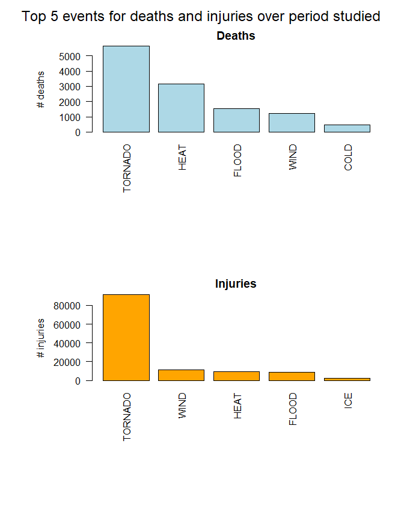
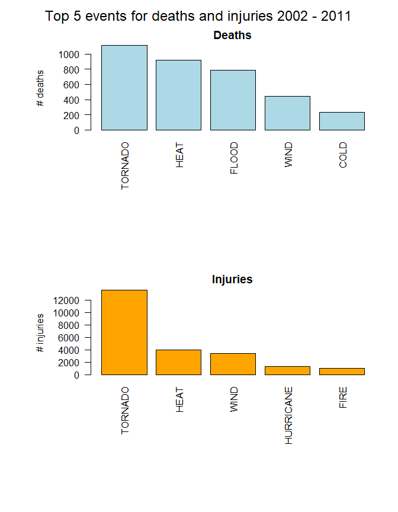

##Synopsis
Weather data were used to identify the events that had most impact on health and economy.  Data were available from 1950, but results from the period of 2002 to 2011 were reported as the data were more complete.

There were multiple classifications of the same type of weather event.  10 broader groups were chosen and the events were reclassified according to these broad groups to create the analysis datasets.

Using the broad groups, in the period between 2002 and 2011, HEAT was responsible for the most deaths (>2000) and TORNADO was responsible for the most injuries (>10,000).

Flood was most damaging to property and crops, causing > $140 billion and $4 billion respectively.  Hurricane was the next most damaging for property and crops.


##Data processing
The sections below describe how the data were loaded and processed for analysis

###Packages used

```r
library(dplyr)
```

```
## 
## Attaching package: 'dplyr'
```

```
## The following objects are masked from 'package:stats':
## 
##     filter, lag
```

```
## The following objects are masked from 'package:base':
## 
##     intersect, setdiff, setequal, union
```

```r
library(lattice)
library(tidyr)
```

###Load data

A link to the storm data is found on the Coursera website:
https://www.coursera.org/learn/reproducible-research/peer/OMZ37/course-project-2

Right click the Storm Data hyperlink and copy link address:
https://d396qusza40orc.cloudfront.net/repdata%2Fdata%2FStormData.csv.bz2

Assign the link address to variable url, and use to download file to working directory.

Use the chunk option cache = TRUE to save knit time.


```r
url <- "https://d396qusza40orc.cloudfront.net/repdata%2Fdata%2FStormData.csv.bz2"
filename <- "storm-data.csv.bz2"  # Saved file name, saved to working directory
download.file(url, filename)
data <- read.csv(filename)
```


###Process data for analysis
The EVTYPE variable in the data has many similar events which need to be grouped.
The grouping will not be perfect but demonstrates an approach that might be improved upon.

```r
data$group <- NA #Adds a column of NAs with colname group to the data dataframe

snowrows <- grep("snow",
                 data$EVTYPE,
                 ignore.case = TRUE)

icerows <- grep("ice", data$EVTYPE, ignore.case = TRUE)
floodrows <- grep("flood", data$EVTYPE, ignore.case = TRUE)
hailrows <- grep("hail", data$EVTYPE, ignore.case = TRUE)
tornadorows <- grep("tornado", data$EVTYPE, ignore.case = TRUE)
firerows <- grep("fire", data$EVTYPE, ignore.case = TRUE)
windrows <- grep("wind", data$EVTYPE, ignore.case = TRUE)
heatrows <- grep("heat", data$EVTYPE, ignore.case = TRUE)
coldrows <- grep("cold", data$EVTYPE, ignore.case = TRUE)
hurricanerows <- grep("hurricane", data$EVTYPE, ignore.case = TRUE)


# Replace the NAs in the group column with one of the weather event groups
data[snowrows, "group"] <- "SNOW"
data[icerows, "group"] <- "ICE"
data[floodrows, "group"] <- "FLOOD"
data[hailrows, "group"] <- "HAIL"
data[tornadorows, "group"] <- "TORNADO"
data[firerows, "group"] <- "FIRE"
data[windrows, "group"] <- "WIND"
data[heatrows, "group"] <- "HEAT"
data[coldrows, "group"] <- "COLD"
data[hurricanerows, "group"] <- "HURRICANE"
```


Generate an analysis dataset for health question. 
Relevant variables are STATE, group, FATALITIES, INJURIES

Generate an analysis dataset for economy question. 
Relevant variables are BGN_DATE, BGN_TIME, STATE, group, PROPDMG:CROPDMGEXP, REMARKS, REFNUM


```r
health <- data %>% select(STATE, group, FATALITIES, INJURIES)
tidyhealth <- gather(health, outcome, count, -STATE, -group)
tidyhealth$outcome <- as.factor(tidyhealth$outcome)

# create subsets for last 10 years, 
# convert data column to date

data$BGN_DATE <- as.Date(as.POSIXct(data$BGN_DATE, format = "%m/%d/%Y %H:%M:%S"))

date1 <- as.Date("2001-12-31")
date2 <- as.Date("2012-01-01")

data00s <- data[data$BGN_DATE > date1 & data$BGN_DATE < date2, ]
h00s <- data00s %>% select(STATE, group, FATALITIES, INJURIES)
tidy00s <- gather(h00s, outcome, count, -STATE, -group)
tidy00s$outcome <- as.factor(tidy00s$outcome)

econ <- data %>% select(BGN_DATE, BGN_TIME, STATE, group, PROPDMG:CROPDMGEXP, REFNUM)
econ00s <- data00s %>% select(BGN_DATE, BGN_TIME, STATE, group, PROPDMG:CROPDMGEXP, REFNUM)
```


###Determine which weather event caused most injuries and fatalities across entire US

Use tapply to determine the number of injuries and fatalities for each weather event using the assigned groups rather than the recorded events

Entire data set and data limited to the most recent 10 years were examined.


```r
harm_event <- with(tidyhealth,
                   tapply(count, 
                          list(group, outcome), 
                          sum,
                          na.rm = TRUE)) %>% 
        as.data.frame()

harm_event00s <- with(tidy00s,
                      tapply(count, 
                             list(group, outcome), 
                             sum,
                             na.rm = TRUE)) %>% 
        as.data.frame()

fatal <- harm_event[which.max(harm_event$FATALITIES), ] # harm_event must be df for this to work
fatalevent <- rownames(fatal)
nfatal <- fatal[1,1]

fatal00s <- harm_event00s[which.max(harm_event00s$FATALITIES), ] # harm_event must be df for this to work
fatalevent00s <- rownames(fatal00s)
nfatal00s <- fatal00s[1,1]

injury <- harm_event[which.max(harm_event$INJURIES), ]
injuryevent <- rownames(injury)
ninjury <- injury[1,2]

injury00s <- harm_event00s[which.max(harm_event00s$INJURIES), ]
injuryevent00s <- rownames(injury00s)
ninjury00s <- injury00s[1,2]
```

Rank the data health data and determine the top 5 events most damaging to health.


```r
fatal_rank <- harm_event[order(harm_event$FATALITIES, decreasing = TRUE), ]
fatal_top_5 <- fatal_rank[1:5, ]

fatal00s_rank <- harm_event00s[order(harm_event00s$FATALITIES, decreasing = TRUE), ]
fatal00s_top_5 <- fatal00s_rank[1:5, ]

injury_rank <- harm_event[order(harm_event$INJURIES, decreasing = TRUE), ]
injury_top_5 <- injury_rank[1:5, ]

injury00s_rank <- harm_event00s[order(harm_event00s$INJURIES, decreasing = TRUE), ]
injury00s_top_5 <- injury00s_rank[1:5, ]

fatal_top_5
```

```
##         FATALITIES INJURIES
## TORNADO       5636    91407
## HEAT          3138     9224
## FLOOD         1525     8604
## WIND          1228    11458
## COLD           451      320
```

```r
injury_top_5
```

```
##         FATALITIES INJURIES
## TORNADO       5636    91407
## WIND          1228    11458
## HEAT          3138     9224
## FLOOD         1525     8604
## ICE            102     2164
```

```r
fatal00s_top_5
```

```
##         FATALITIES INJURIES
## TORNADO       1112    13588
## HEAT           920     4019
## FLOOD          789      820
## WIND           445     3366
## COLD           235       36
```

```r
injury00s_top_5
```

```
##           FATALITIES INJURIES
## TORNADO         1112    13588
## HEAT             920     4019
## WIND             445     3366
## HURRICANE         67     1291
## FIRE              76     1051
```

###Use the EXP information to calculate actual damage to property - **limited to latest decade**
Based on this internet article https://rstudio-pubs-static.s3.amazonaws.com/58957_37b6723ee52b455990e149edde45e5b6.html
create an EXP dataframe which matches entires to multiplication factors


```r
expdf <- as.data.frame(unique(econ$PROPDMGEXP))
colnames(expdf) <- "PROPDMGEXP"
expdf$factor = c(10^3, 10^6, 1, 10^9, 10^6, 1, 10, 10, 10, 1, 10, 10, 10, 100, 10, 100, 1, 10, 10)


# Merge expdf with econ
econ1 <- merge(econ00s, expdf, by = "PROPDMGEXP")
econ2 <- merge(econ1, expdf, by.x = "CROPDMGEXP", by.y = "PROPDMGEXP")


# Calculate numerical value for property damage using mutate

econvalue <- econ2 %>%  mutate(property = PROPDMG * factor.x, crop = CROPDMG * factor.y)

# Now sum across all the event types

propsum <- with(econvalue,
                tapply(property,
                       group,
                       sum,
                       na.rm = T)) %>% 
        as.data.frame()
colnames(propsum) <- "propvalue"
propsum$event <- rownames(propsum)

cropsum <- with(econvalue,
                tapply(crop, 
                       group, 
                       sum,
                       na.rm = T)) %>% 
        as.data.frame()
colnames(cropsum) <- "cropvalue"
cropsum$event <- rownames(cropsum)

propmax <- propsum[which.max(propsum$propvalue), ]
propmax
```

```
##          propvalue event
## FLOOD 144321511800 FLOOD
```

```r
cropmax <- cropsum[which.max(cropsum$cropvalue), ]
cropmax
```

```
##        cropvalue event
## FLOOD 4404421400 FLOOD
```

```r
prop00s <- propsum[which.max(propsum$propvalue), ] # propsum must be df for this to work
propevent00s <- rownames(prop00s)
nprop00s <- prop00s[1,1]

crop00s <- cropsum[which.max(cropsum$propvalue), ] # cropsum must be df for this to work
cropevent00s <- rownames(crop00s)
ncrop00s <- crop00s[1,1]
```


```r
prop_rank <- propsum[order(propsum$propvalue, decreasing = TRUE), ]

crop_rank <- cropsum[order(cropsum$cropvalue, decreasing = TRUE), ]  

prop_rank$propvalbil <- prop_rank$propvalue / 1000000000
crop_rank$cropvalbil <- crop_rank$cropvalue / 1000000000

prop_rank
```

```
##              propvalue     event  propvalbil
## FLOOD     144321511800     FLOOD 144.3215118
## HURRICANE  72342695010 HURRICANE  72.3426950
## TORNADO    18406922660   TORNADO  18.4069227
## WIND       10007903390      WIND  10.0079034
## HAIL        9174281520      HAIL   9.1742815
## FIRE        4959547000      FIRE   4.9595470
## ICE         1964717800       ICE   1.9647178
## SNOW         236536730      SNOW   0.2365367
## COLD          10941000      COLD   0.0109410
## HEAT           5923200      HEAT   0.0059232
```

```r
crop_rank
```

```
##            cropvalue     event cropvalbil
## FLOOD     4404421400     FLOOD  4.4044214
## HURRICANE 3056382800 HURRICANE  3.0563828
## HAIL      1394687900      HAIL  1.3946879
## WIND      1154522600      WIND  1.1545226
## HEAT       492578500      HEAT  0.4925785
## FIRE       297479430      FIRE  0.2974794
## TORNADO    220589910   TORNADO  0.2205899
## COLD        71010000      COLD  0.0710100
## ICE          8665000       ICE  0.0086650
## SNOW          330000      SNOW  0.0003300
```


##Results
####Across the United States, which types of events (as indicated in the \color{red}{\verb|EVTYPE|}EVTYPE variable) are most harmful with respect to population health?

TORNADO was the weather event responsible for the most injuries and fatalities across the United States both for the entire data set and the most recent 10 year period:


```r
fatal
```

```
##         FATALITIES INJURIES
## TORNADO       5636    91407
```

```r
injury
```

```
##         FATALITIES INJURIES
## TORNADO       5636    91407
```

```r
fatal00s
```

```
##         FATALITIES INJURIES
## TORNADO       1112    13588
```

```r
injury00s
```

```
##         FATALITIES INJURIES
## TORNADO       1112    13588
```

TORNADO was responsible for 5636 fatalities and 91407 injuries in the period studied.


TORNADO was responsible for 1112 fatalities and 13588 injuries in the period between 2002 and 2011.


```r
par(mfrow=c(2, 1), 
    oma = c(0, 0, 2, 0),
    mar = c(12, 8, 2, 2),
    mgp = c(4, 1, 0))


barplot(fatal_top_5$FATALITIES, 
                     names.arg = rownames(fatal_top_5), 
                     las = 2,
                     col = "light blue",
                     main = "Deaths",
                     ylab = "# deaths")

barplot(injury_top_5$INJURIES, 
                     names.arg = rownames(injury_top_5), 
                     las = 2,
                     col = "orange",
                     main = "Injuries",
                     ylab = "# injuries")

mtext("Top 5 events for deaths and injuries over period studied", 
      outer = TRUE, 
      cex = 1.5)
```

<!-- -->


```r
par(mfrow=c(2, 1), 
    oma = c(0, 0, 2, 0),
    mar = c(12, 8, 2, 2),
    mgp = c(4, 1, 0))


barplot(fatal00s_top_5$FATALITIES, 
        names.arg = rownames(fatal00s_top_5), 
        las = 2,
        col = "light blue",
        main = "Deaths",
        ylab = "# deaths")

barplot(injury00s_top_5$INJURIES, 
        names.arg = rownames(injury00s_top_5), 
        las = 2,
        col = "orange",
        main = "Injuries",
        ylab = "# injuries")

mtext("Top 5 events for deaths and injuries 2002 - 2011", 
      outer = TRUE, 
      cex = 1.5)
```

<!-- -->


The panel plot shows that Tornado was the most significant factor in deaths and injuries.  Excessive heat caused the next greatest amount of deaths.  All other weather events caused far few deaths or injuries than tornado.

###Across the United States, which types of events have the greatest economic consequences?

This analysis was limited to the period between 2002 and 2011.

FLOOD caused the most damage to property, and  the most damage to crops during the period examined.
The next most damaging weather event to property and crops was HURRICANE.


```r
par(mfrow=c(2, 1), 
    oma = c(0, 0, 2, 0),
    mar = c(12, 8, 2, 2),
    mgp = c(4, 1, 0))

barplot(prop_rank$propvalbil, 
        names.arg = prop_rank$event, 
        las = 2,
        col = "light blue",
        main = "Property damage",
        ylab = "Value (billion $)")

barplot(crop_rank$cropvalbil, 
        names.arg = crop_rank$event, 
        las = 2,
        col = "orange",
        main = "Crop damage",
        ylab = "Value (billion $)")

mtext("Top 10 weather events property and crop damage 2002 - 2011", 
      outer = TRUE, 
      cex = 1.5)        
```

<!-- -->
